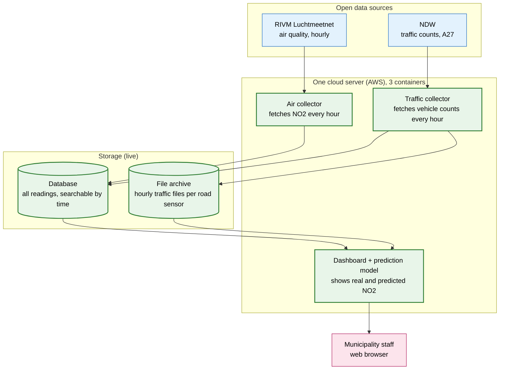
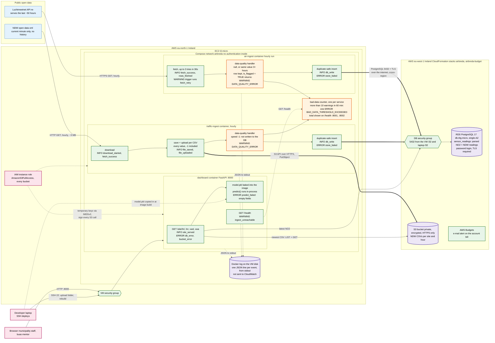

# Architecture Design Document
**Student number:** 241960 **Student name:** Mate Kovasznai

**Date** 02/10/2026

## 1. Architecture diagram 

### Overview for stakeholders




### Technical view: deployment, data flows and permissions



**Legend:** 
- Green = running
- Orange = the data-quality path 
- Purple = where data is kept 
- Pink = people and identities holding permissions 
- Blue = external sources 
- Data path = Thick arrows  
- Control, logs, permissions = dotted arrows 


## 2. Architecture Decision Records


### ADR-001: Initial Data Storage Strategy (Day 1)


**Context.** We collect two kinds of data. Air quality (NO2) arrives as one number per hour, and the source re-sends the last two days whenever we ask, so a missed hour can be fetched again. Traffic counts come from one large national file that only ever holds the current minute: whatever we do not save is gone.

**Decision.** We keep each kind of data where it fits best: readings go into a **relational database** (PostgreSQL on Amazon RDS), and traffic files go into **object storage** (Amazon S3).

**Consequences.** Every reading has the same four fields (station, time, measurement type, value), which fits a table exactly. Training the model means matching each traffic hour to its air-quality hour, a join, which most NoSQL stores make awkward. At about 114,000 rows per corridor per year, any database handles the volume easily. NoSQL would win when the schema keeps changing, it is not our case.

The traffic source keeps no history, so the file we download is the only record we will ever have of that hour that's why I use object storage. Files are written once and never changed, so they need no database. 

Duplicates are expected: every air run fetches the last 50 hours again, and any re-run sends the same readings twice. Each reading is identified by its station, time and measurement type. A reading that is already stored is skipped (`ON CONFLICT DO NOTHING`), so a second run changes nothing. 

### ADR-002: Messaging Architecture (Day 2)

**Context.** Our data comes from two different organisations, and they behave very differently:

**Decision.** We run **two separate fetchers**, `air-ingest` and `traffic-ingest`, each in its own container with its own code and image. Each one writes straight to storage: the database, and for traffic also the S3 bucket. There is no queue between them.

**Consequences.** One failure does not stop the other. If NDW is down or sends a broken file, air collection carries on, and the other way round. In one program, a crash while reading the traffic file would stop air too. The ingests can run at different speeds. Today both run every hour, but traffic can move to every 5 minutes (ADR-004) without touching air, which only changes once an hour. Problems are easy to find and fix. Each fetcher reports its own health on `/health`, so we see which source is failing, and a fix to one is rebuilt and deployed without touching the other.
There is no queue because each fetcher sends one batch an hour to one place, so a queue would only be one more part to run and secure. The cost is that traffic has no buffer: if S3 or the server is down, that hour of traffic is lost. A queue (Amazon SQS) comes back when a second program needs the same readings, or when collection moves off this one server.

### ADR-003: Resilience Strategy (Day 2)


**Context.** The dashboard's main address, `/site/{id}`, needs three parts: 
1. the server 
2. the database (for NO2) and 
3. file storage (for traffic). 

If any of them fails, it returns an error. Short network hiccups are already handled, the air collector retries a failed request up to 3 times within 30 seconds, and the traffic collector tries again at the next hourly run. Every run ends with one of four codes (0 OK, 1 source unreachable, 2 unusable data, 3 our storage failed), so an alarm can react without reading logs. The client's target for the database is to be back within **15 minutes** (the recovery time objective, RTO) and to lose at most **one hour** of data (the recovery point objective)

**Decision.** SLO = 99.5% for `/site/{id}`. This is measured per calendar month as the share of minutes in which a check of `/site/{id}` gets a correct answer within 2 seconds. It leaves an error budget of about **3.6 hours a month** (0.5% of 730 hours).

**Consequences.**  The server has a single weak spot: it has no standby, it is rebuilt by hand, and nothing alerts anyone. So the 99.5% target is neither measured nor guaranteed yet. Meeting it needs an outside check of `/site/{id}` every minute with an alarm, and a server that can be recreated automatically. Why not 99.9% SLO: it allows only 44 minutes a month, so a single crash noticed the next morning would break it. AWS itself pays refunds below 99.5% for one server and for a database without a standby, so promising more than our parts would be dishonest.


### ADR-004: Compute Strategy (Day 3)

**Context.** The collectors already ran as containers on a laptop and had to move to the cloud. Each one wakes up once an hour, makes one or two web requests and goes back to sleep.

**Decision.** We rent **one small virtual server** (EC2 t3.micro: 2 processor cores, 1 GB of memory) and run the unchanged Compose setup on it.

**Consequences.** Why a server, not a managed container service? The files that worked on the developer laptop work on the server unchanged. Easier collaboration, and **at 50 corridors, every 5 minutes.** Only traffic gets faster. RIVM publishes NO2 once an hour, so polling air every 5 minutes gains nothing. The national traffic file covers every corridor in one download, so that means 12 downloads an hour, not 600. A single server would still be the wrong home: every missed run is a sample that can never be fetched again, there would be 12 an hour, and the server is one machine in one data centre. We now maintain a server ourselves: updates, Docker plugins installed by hand, and access rules. 


### ADR-005: Compute & Deployment Strategy (Day 4)


**Context.** Day 4 added the dashboard, so the server runs three containers on 1 GB of memory. Updates are done by hand: run the 15 automated tests, copy the folder to the server, rebuild.

**Decision.** **The dashboard runs as a third container on the same server**, started together with the two collectors, and always deployed after the tests pass. It is public on port 8000 it only shows data, so it has no login.


**Consequences.**  The dashboard's health page asks both collectors how they are doing over the private network the three containers share, so it works only next to them. It reuses the deployment we already have: one folder, one command. And it costs nothing extra. Today all three containers are started with Compose in the background (`docker compose up -d`), with no restart rule and no systemd unit.  One crash or reboot takes down collection and the dashboard together, and until the restart rule is added, they stay down.


### ADR-006: ML Serving Architecture (Day 4)


**Context.** The dashboard needs a predicted NO2 value and a risk score between 0 and 1 that NO2 is too high, for a given amount of traffic and hour of the day.

**Decision.**  A **linear regression** predicts NO2 from a site's traffic and the hour of the day. It is trained on our own accumulated data: `airbreda/build_training_data.py` reads the stored NO2 and traffic readings from the database and matches them by hour, and `airbreda/train.py` writes `model.pkl`. For the risk I use the **sigmoid-and-threshold** approach. The predicted NO2 is compared with **40 µg/m³**, the EU's legal yearly limit, and passed through an S-curve: 0.5 at 40, 0.12 at 30 and 0.88 at 50. 

**Consequences.**
The current model was trained on 48 rows (12 hours × 4 sites, 1–2 October) and learned NO2 ≈ 27.95 + 0.0031 × traffic + 0.24 × hour (R² 0.34 on its own training rows). Busier sites therefore get a higher risk: at 10:00 UTC, 0.33 for hrl and 0.14 for vwa. Twelve hours is far too little for a reliable model. It shows the pipeline works, and it improves with every retrain as data accumulates.
Training-serving skew means the model gets inputs in use that were prepared differently from the inputs it learned on, so it quietly gives wrong answers. We avoid it by training on exactly what the dashboard sends: one site's traffic in its one stored minute of the hour, and the UTC hour. A baked model ships together with the code that prepares its inputs and the library versions that load it. If the prediction fails, `/site/{id}`  still answers normally with the real NO2 and traffic values. The two prediction fields are left empty, the page shows "no prediction", and the error is logged. The real readings are still true and are what a person needs most. The model runs **inside the dashboard**: its file is under 1 KB, and a separate prediction service would add a network step, a second deployment and a new way to fail.


## 3. Trade-off justifications

**Storage type:** PostgreSQL plus S3, rather than one store for everything.
We put the parsed readings in a relational database and the traffic files in object storage. The alternatives were keeping everything in S3 and querying it with Athena, or using a time-series database. The readings are small, about 17 MB per corridor per year, and the dashboard and the model query them by time all the time, which a database does well. The traffic files are large, about 2.2 GB a month, and are written once and never changed, which is what object storage is for. Each month of files adds only $0.05 to the S3 bill, and the same data in RDS would cost over five times as much per GB.
We gave up having one place to query and secure. Two stores mean two sets of permissions, two things that can fail, and joins across them done in code instead of SQL.

**Compute:** one virtual machine, rather than a managed container service.
We run all three containers with Docker Compose on one EC2 t3.micro, the alternatives were ECS on Fargate, Lambda and EKS. The VM ran the files from the laptop unchanged, so we moved to the cloud with no rewrite. Lambda would have meant rewriting the code as handlers, and EKS costs about $73 a month for its control plane alone.
We gave up self-healing and freedom from maintenance. If the VM dies, all collection and the dashboard stop until someone rebuilds it by hand, and we patch and secure the server ourselves. Fargate becomes the better choice at 50 corridors, where scheduled tasks would cost about $1.71 a month.

**Messaging:** direct writes, rather than a queue.
Each fetcher writes straight to the database and S3, and the same reading written twice is ignored. The alternatives were a Redis queue in Compose, Amazon SQS and Kafka on MSK. Each source produces one batch an hour for one destination, so a queue would only add a part to run, secure and monitor. Kafka's smallest cluster costs more than our whole stack.
We gave up a buffer. If S3 or the server is down for an hour, that hour of traffic is lost. Air is not affected, because the next run fetches the missed hours again.

**Disaster recovery:** RDS Multi-AZ, rather than backup-and-restore.
We chose a standby copy of the database in a second data centre that AWS switches to automatically. The alternatives were backup-and-restore, a read replica, a copy in another region, Aurora and active-active. Multi-AZ meets the client's target of 15 minutes of downtime and at most 1 hour of data lost: it fails over in 1–2 minutes, loses almost nothing and needs no person. Backup-and-restore is cheaper, but it depends on someone restoring the database and repointing the services, so 15 minutes would be a hope, not a promise.
We gave up $15.66 a month ($34.26 instead of $18.60), and protection against losing a whole AWS region. Multi-AZ is also deferred, so today we have only daily backups.

## 4. Cloud provider rationale for the Municipality of Breda

We run AirBreda on Amazon Web Services (AWS), in its data centres in Ireland.

**What AWS gives us.** We rent computers, storage and a database by the hour instead of buying our own. For one road it costs about €28 a month, and we can turn it off when it is not needed. AWS spreads every stored file over at least three separate data centres and can keep a spare database ready in a second building, so one fire or power cut does not lose data. 

**Why it suits a Dutch public body.** All our data stays inside the European Union, in Ireland, so it falls under European privacy law. The data itself is low-risk: air measurements and vehicle counts are already published openly by RIVM and NDW, and AirBreda stores no personal information. AWS is independently audited against ISO 27001, the security standard on which the Dutch government's own security baseline (the BIO) is built. 


**What we would lose by switching.** The heart of AirBreda (its programs, its standard database and its file formats) would move to another provider without much effort. What would need redoing are the parts tied to AWS: the setup files for the database and storage, the permission rules, and our team's know-how. I estimate a few weeks of work, with a risk of losing traffic data during the move, because the traffic source keeps no history. A provider with a data centre in the Netherlands, such as Microsoft Azure, would bring the data closer to home, but it would not change the legal picture much.

## 5. Cost estimate

All figures are **AWS list prices for eu-west-1 (Ireland)**, on-demand, 730 hours per month, excluding VAT. They come from the official AWS price list files behind calculator.aws, published 11 Sep - 1 Oct 2026. Euros use the ECB reference rate of 1 October 2026: **€1 = $1.1298**.

| Component | Current (1 corridor) | At 10 corridors | At 50 corridors |
|---|---|---|---|
| Compute (VM) | **€11.22**: `t3.micro` $8.32 + 8 GiB gp3 $0.70 + public IPv4 $3.65 | **€18.59**: `t3.small` $16.64 + disk $0.70 + IPv4 $3.65 | **€20.10**: dashboard on a `t3.small` $21.00 + ingestion on Fargate $1.71 |
| Database | **€16.46**: `db.t4g.micro` single-AZ $12.41 + 20 GB gp2 $2.54 + public IPv4 $3.65 | **€16.46**: same instance | **€16.46**: same instance |
| Object storage | **€0.71**: raw XML after 12 months ~26 GB $0.60 + PUTs $0.02 + dashboard reads $0.19 | **€2.31**: storage $0.60 + PUTs $0.15 + dashboard reads $1.87 | **€1.17**: storage $0.60 + PUTs $0.73 |
| **Total** | **€28.39 / month** (Excluding the free tier) | **€37.36 / month** | **€37.73 / month** |


Multi-AZ  would raise the database line to **€30.32** in every column.

**Is a single VM still right?**

- **At 10 corridors: yes.** Today's parser needs ~5–8 of the 12 vCPU-minutes per hour a `t3.micro` earns, so a `t3.small` gives headroom.

- **At 50 corridors: no, but not because of CPU or cost.** With today's parser, 200 sites need 23–40 vCPU-minutes an hour (a `t3.large`, €62.78), but a one-pass parser makes CPU almost flat. The real reason is data loss: one VM outage would silently lose traffic for 200 sites that NDW cannot give back. Ingestion therefore moves to scheduled Fargate tasks (ADR-005), and only the stateless dashboard stays on a VM, for nearly the same compute cost (€20.10).

## 6. Reflection

**The decision I am least confident in** is running traffic ingestion on a single VM with no buffer, against a source that keeps only the current minute. Air data can be re-fetched for 50 hours, traffic cannot. If the VM is down, stuck or out of memory, those hours are gone for good, and nothing alerts anyone. To become confident I would need three numbers: how often the VM misses runs (gaps in `last_successful_fetch` over a few weeks), how sensitive the model is to missing hours (tested by deleting random training hours), and how many missing hours the municipality tolerates before it stops trusting the dashboard. Unfortunatly due to the projects time limitation I could not analyze further this problem.

With a full year of real readings, the model would change in three ways. The *features* would grow. I would add weather, because wind speed, wind direction and temperature govern how NO2 disperses as much as traffic governs how much is produced. I would average traffic over the whole hour instead of one sampled minute, and drop rows flagged as stale or null. The *algorithm* would keep linear regression as the explainable baseline, but NO2 does not rise in a straight line with traffic, so a regularised regression with interaction terms, or gradient-boosted trees, would likely fit better. The *evaluation* would split by time, because a random split leaks the future into training: train on the first nine months, test on the last three, then validate on a rolling origin across seasons. Every model would have to beat a naive "next hour equals this hour" baseline, with errors in µg/m³. For the risk score I would report precision and recall, because a missed exceedance and a false alarm cost different things.

If AirBreda were a real production system, the first thing I would add is Infrastructure as Code for the whole stack, deployed by a CI/CD pipeline. Almost every problem in this project comes back to hand-built infrastructure. The VM was created by clicking in a different region from the stack, so the database must trust the VM's changing IP. Deployment is `scp` plus a manual rebuild, with no record of which version runs, and the security rules are edited by hand after every network change. One template creating the VM, database, bucket and a role scoped to that bucket would make the system reproducible in minutes. A pipeline that runs the 15 tests and builds the images on every change means nobody deploys untested code. Next would come alerting on missed ingestion runs, the design's biggest exposure.

<script type="module">
  // GitHub renders ```mermaid natively; GitHub Pages (Jekyll) does not, so render it here.
  import mermaid from "https://cdn.jsdelivr.net/npm/mermaid@11/dist/mermaid.esm.min.mjs";
  document.querySelectorAll("pre > code.language-mermaid, div.language-mermaid pre code").forEach((code) => {
    const box = document.createElement("div");
    box.className = "mermaid";
    box.textContent = code.textContent;
    (code.closest("div.language-mermaid") || code.parentElement).replaceWith(box);
  });
  mermaid.initialize({ startOnLoad: false, securityLevel: "strict" });
  await mermaid.run({ querySelector: ".mermaid" });
</script>
